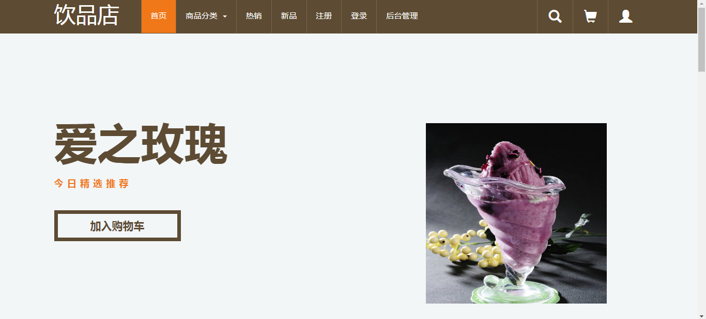
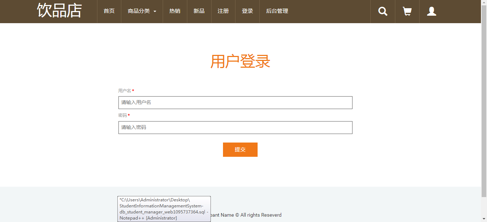
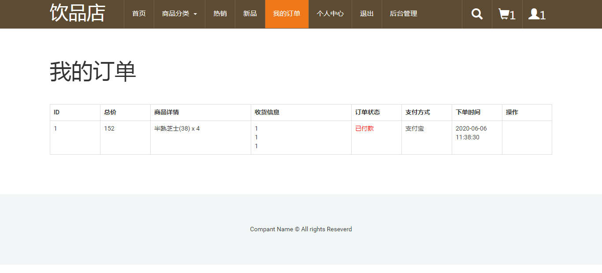
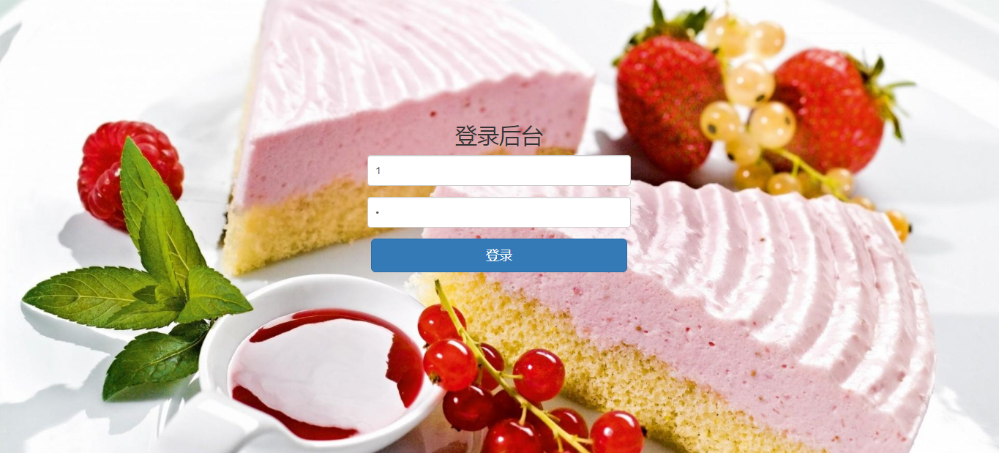
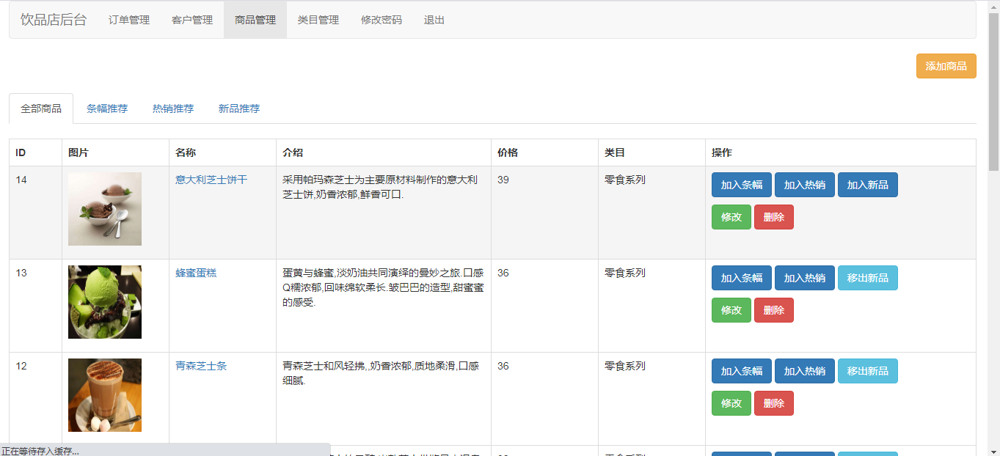
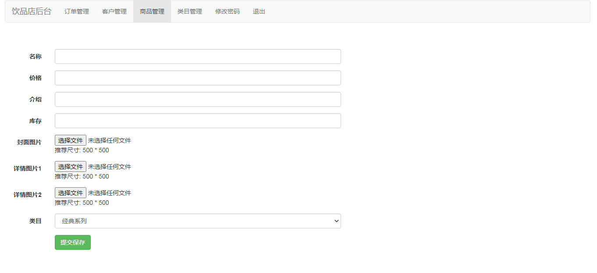

<h1 align="center">蛋糕商城管理系统1</h1>

## 简介
蛋糕商城管理系统：角色分为管理员、用户；功能包括商品管理、订单管理、客户管理、类别管理、用户登录和购物车功能。    --计算机毕业设计源码；毕设源码；java毕业设计源码

## 联系方式

<h3 align="center">获取完整代码与数据库文件 + 微信：deepguan QQ: 86050149 QQ群: 783742310</h3>

<h3 align="center">可帮忙远程部署 包运行成功！提供远程部署、修改代码、设计文档指导、代码讲解等服务！</h3>

## 功能介绍（完整见运行截图）
管理员：登录后台系统进行商品管理，包括新建、编辑、删除商品信息，上传商品图片，调整商品类别及状态。管理订单，查看及更新订单状态，处理客户信息及订单支付情况。提供系统用户权限管理，更新管理员用户密码。用户界面直观简洁，操作便利，提高日常管理效率。

用户：通过网站首页访问商品分类、热销新品及推荐蛋糕，查看商品详情并加入购物车，进行在线购物。用户注册并登录后，可访问个人中心查询订单、修改个人信息、管理收藏及地址。支持多种支付方式，以便捷的购物流程提升用户购买体验。

## 运行截图

本代码来源于网络,仅供学习参考使用!

